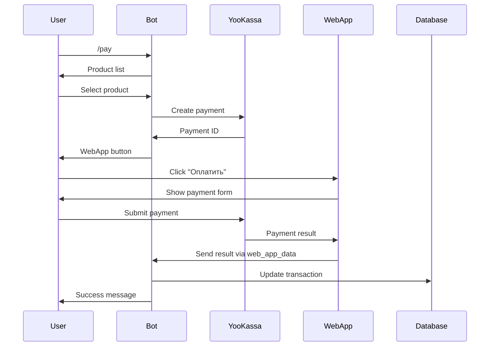

# WebApp Payment Setup Guide

This guide explains how to set up the in-Telegram payment system using YooKassa WebApp.

## Overview

Users can now pay **without leaving Telegram** using a WebApp that displays the YooKassa payment form directly in the chat.

## Architecture

```
User → /pay → Select Product → Bot creates payment → WebApp opens → User pays → Success sent to bot
```

## Setup Options

### Option 1: Local Testing (Development)

For testing on your local machine:

#### 1. Install Dependencies

```bash
pip install -r requirements.txt
```

#### 2. Configure Environment

Add to `.env`:

```env
# WebApp URL (for local testing)
WEBAPP_URL=http://localhost:8080

# YooKassa credentials
YOOKASSA_SHOP_ID=your_test_shop_id
YOOKASSA_SECRET_KEY=your_test_secret_key
```

#### 3. Start WebApp Server

Open a **new terminal** and run:

```bash
cd webapp
python server.py
```

You should see:
```
Starting WebApp server on port 8080
WebApp URL will be: http://localhost:8080/payment
```

#### 4. Expose Local Server (Required for Telegram)

Telegram WebApps **must** use HTTPS. Use `ngrok` to create a secure tunnel:

```bash
# Install ngrok: https://ngrok.com/download
ngrok http 8080
```

You'll get a URL like: `https://abc123.ngrok-free.app`

#### 5. Update WEBAPP_URL

Update your `.env`:

```env
WEBAPP_URL=https://abc123.ngrok-free.app
```

#### 6. Restart Bot

```bash
python bot/main.py
```

#### 7. Test!

In Telegram:
1. Send `/pay`
2. Select product
3. Click "💳 Оплатить"
4. WebApp opens **inside Telegram**
5. Use test card: `5555 5555 5555 4444`
6. Payment completes without leaving chat!

---

### Option 2: Production Deployment

For production, you need to host the WebApp publicly.

#### Hosting Options

**A. Vercel (Easiest - Free)**

1. Create `vercel.json`:

```json
{
  "version": 2,
  "builds": [
    {
      "src": "webapp/server.py",
      "use": "@vercel/python"
    }
  ],
  "routes": [
    {
      "src": "/(.*)",
      "dest": "webapp/server.py"
    }
  ]
}
```

2. Deploy:

```bash
npm install -g vercel
vercel
```

3. Get URL: `https://your-project.vercel.app`

4. Update `.env`:

```env
WEBAPP_URL=https://your-project.vercel.app
```

**B. Heroku**

```bash
# Create Procfile
echo "web: gunicorn webapp.server:app" > Procfile

# Deploy
heroku create nutritionist-webapp
git push heroku main
```

**C. Your Own Server (VPS)**

```bash
# On your server (Ubuntu/Debian)
sudo apt install nginx

# Install dependencies
pip install -r requirements.txt

# Run with gunicorn
gunicorn -w 4 -b 0.0.0.0:8080 webapp.server:app

# Configure nginx as reverse proxy with SSL (Let's Encrypt)
```

**D. Cloudflare Pages / Netlify**

These work well for static hosting. Since we need Python, use Vercel or Heroku instead.

---

## Configuration

### Environment Variables

```env
# Bot Configuration
TELEGRAM_BOT_TOKEN=your_bot_token
SUPABASE_URL=your_supabase_url
SUPABASE_KEY=your_supabase_key
OPENAI_API_KEY=your_openai_key

# YooKassa Payment
YOOKASSA_SHOP_ID=your_shop_id
YOOKASSA_SECRET_KEY=your_secret_key
YOOKASSA_RETURN_URL=https://t.me/your_bot_username

# WebApp (IMPORTANT!)
WEBAPP_URL=https://your-webapp-domain.com

# WebApp Server Port (optional)
WEBAPP_PORT=8080
```

### Update payment.html

Edit `webapp/payment.html` line 45:

```javascript
return_url: 'https://t.me/your_bot_username',
```

Replace with your actual bot username.

---

## Payment Flow

### User Experience

1. **User sends `/pay`**
   - Bot shows product list

2. **User selects product**
   - Bot shows product details with price
   - Button: "💳 Оплатить"

3. **User clicks "💳 Оплатить"**
   - **WebApp opens inside Telegram** (no external browser!)
   - Shows YooKassa embedded payment form

4. **User enters card details**
   - Card number
   - Expiry
   - CVC

5. **Payment processes**
   - Success → WebApp sends data to bot → Closes automatically
   - Error → Shows error message
   - Cancel → Back button → Cancels payment

6. **Bot receives payment result**
   - Success: "✅ Платеж успешно завершен!"
   - Error: "❌ Ошибка при оплате"
   - Canceled: "❌ Платеж отменен"

### Technical Flow



---

## Testing

### Test Payment in WebApp

1. Start bot and WebApp server
2. Send `/pay` to bot
3. Select "Консультация - 5000 ₽"
4. Click "💳 Оплатить"
5. WebApp should open with:
   - Product name: "Консультация"
   - Price: "5000 ₽"
   - YooKassa payment form

6. Enter test card:
   - **Card:** 5555 5555 5555 4444
   - **Expiry:** 12/25
   - **CVC:** 123

7. Click "Оплатить"
8. WebApp shows "✅ Оплата успешна!"
9. WebApp closes automatically
10. Bot sends: "✅ Платеж успешно завершен!"

### Test Cancellation

1. Start payment flow
2. Open WebApp
3. Click Telegram's back button
4. Confirm cancellation
5. Bot should show: "❌ Платеж отменен"

### Test Error Handling

1. Start payment
2. In WebApp, enter invalid card: `4111 1111 1111 1112`
3. Should show error message
4. WebApp closes
5. Bot notifies of error

---

## Troubleshooting

### "WebApp не открывается"

**Problem:** WebApp button doesn't work

**Solutions:**
1. Check `WEBAPP_URL` is set correctly in `.env`
2. Make sure URL uses HTTPS (not HTTP)
3. Restart bot after changing environment variables

### "Payment form не показывается"

**Problem:** WebApp opens but payment form doesn't load

**Solutions:**
1. Check browser console for errors (Telegram Desktop: Ctrl+Shift+I)
2. Verify YooKassa credentials are correct
3. Make sure payment ID is being passed in URL
4. Check `payment.html` is being served correctly

### "Платеж успешен но бот не получает данные"

**Problem:** Payment completes but bot doesn't update

**Solutions:**
1. Check `handle_webapp_data` handler is registered
2. Verify bot has permission to receive `web_app_data` updates
3. Check logs for errors in WebApp data handler

### "CORS ошибки"

**Problem:** Cross-origin errors in console

**Solutions:**
1. Make sure `flask-cors` is installed
2. Verify CORS is enabled in `server.py`
3. Check WebApp URL matches exactly in config

---

## Security Considerations

1. **HTTPS Only** - Telegram requires HTTPS for WebApps
2. **Payment ID Validation** - Always verify payment exists before processing
3. **Status Verification** - Check actual YooKassa status, don't trust WebApp data alone
4. **Idempotency** - Use idempotence keys for all payment operations
5. **Error Logging** - Log all payment errors for debugging

---

## Advantages of WebApp Payment

✅ **Better UX** - Users never leave Telegram
✅ **Faster** - No browser redirect
✅ **Mobile-friendly** - Native feel on mobile
✅ **Secure** - Uses YooKassa's official widget
✅ **Real-time** - Immediate status updates to bot

---

## Next Steps

1. ✅ Set up local testing with ngrok
2. ✅ Test full payment flow
3. ✅ Deploy WebApp to production (Vercel/Heroku)
4. ✅ Update production environment variables
5. ✅ Test with real (small) payments
6. ✅ Monitor logs for errors

---

## Support

If you encounter issues:

1. Check logs: `bot/main.py` and `webapp/server.py`
2. Verify environment variables
3. Test with ngrok first before production
4. Review YooKassa documentation: https://yookassa.ru/developers

Good luck with your in-Telegram payments! 🚀
